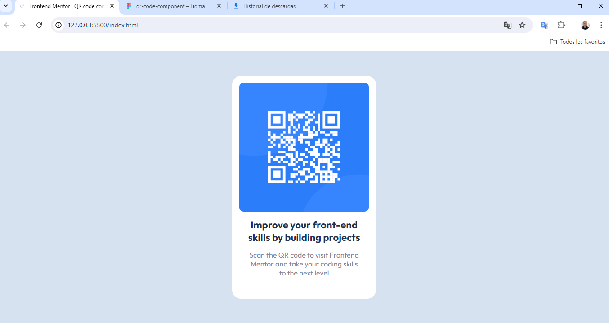
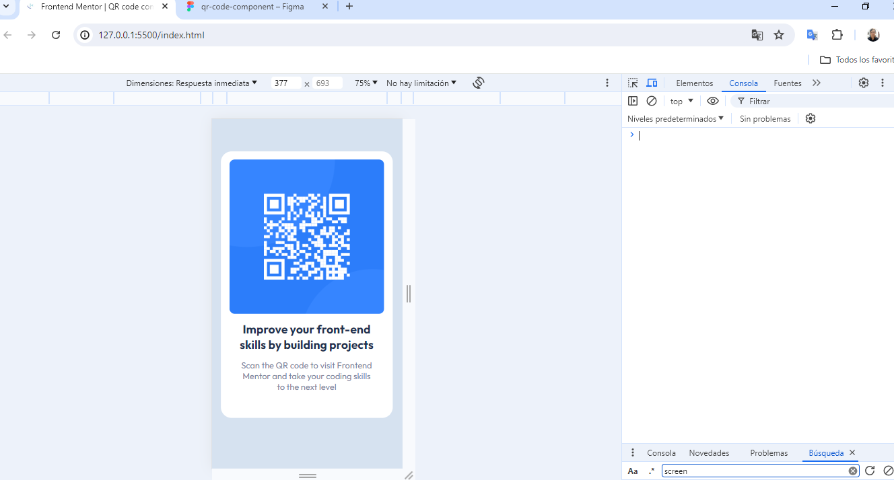

# Frontend Mentor - QR code component solution

This is a solution to the [QR code component challenge on Frontend Mentor](https://www.frontendmentor.io/solutions/qr-code-challengue-with-css-flex-box-wqpMXoqUYk)

## Table of contents

- [Overview](#overview)
  - [Screenshot](#screenshot)
  - [Links](#links)
- [My process](#my-process)
  - [Built with](#built-with)
  - [What I learned](#what-i-learned)
  - [Continued development](#continued-development)
- [Author](#author)


## Overview

### Screenshot
Desktop

Mobile



### Links

- Solution URL: [solution url](https://www.frontendmentor.io/solutions/qr-code-challengue-with-css-flex-box-wqpMXoqUYk)
- Live Site URL: [github pages](https://rineliniguezsosa.github.io/qr-code-component/)
- my likedin profile: [linkedin profile](https://www.linkedin.com/in/rinel-i%C3%B1iguez-758a68203/)

## My process

### Built with

- Semantic HTML5 markup
- CSS custom properties
- Flexbox
- CSS
- Mobile-first workflow

### What I learned

html, css, flex box and media querys 

### Continued development

full stack technologies


## Author
- Frontend Mentor - [@rineliniguezsosa](https://www.frontendmentor.io/profile/rineliniguezsosa)

## requirements 

- [Visual Studio Code](https://code.visualstudio.com/) (or any other code editor of your choice)
- [Live Server Extension](https://marketplace.visualstudio.com/items?itemName=ritwickdey.LiveServer) for Visual Studio Code

## Install

Follow these steps to download and run the project locally

1. **Clone this repository:**

  Open your terminal and run the following command:

   ```bash
   https://github.com/rineliniguezsosa/qr-code-component.git
   ```

2.- **Navigate to the project directory:**

```bash
cd qr-code-component
```

3.-**Open the project in Visual Studio Code:**

```bash
code .
```

## deployment

To deploy the project locally using Live Server, follow these steps:

1. **Install the Live Server extension:**

- Open Visual Studio Code.
- Go to the extensions tab (squares icon in the left sidebar).
- Search for "Live Server" and install the extension developed by Ritwick Dey.

2. **Run Live Server:**

- Open the **index.html** file in Visual Studio Code.
- Right click on the editor and select "Open with Live Server.
- Alternatively, you can click the "Go Live" button in the bottom right corner of Visual Studio Code.

3. **View the project:**

- Live Server will open a new tab in your browser with the URL http://127.0.0.1:5500/ (URL may vary). Here you can see your project in operation.
